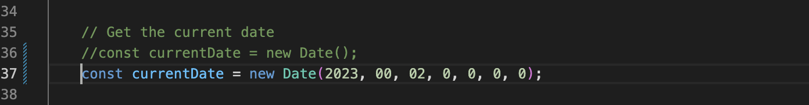
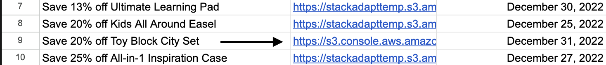
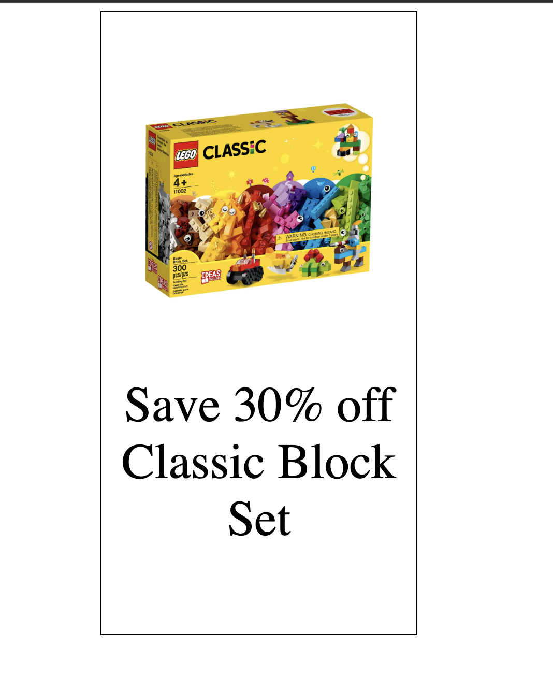
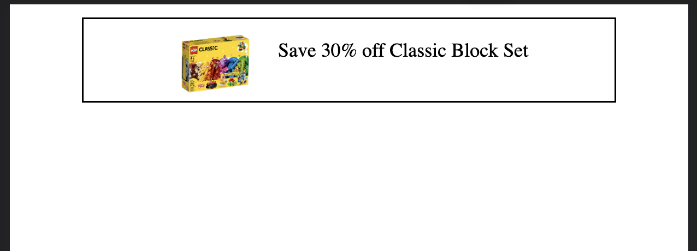
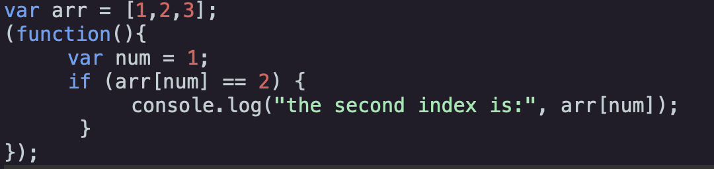
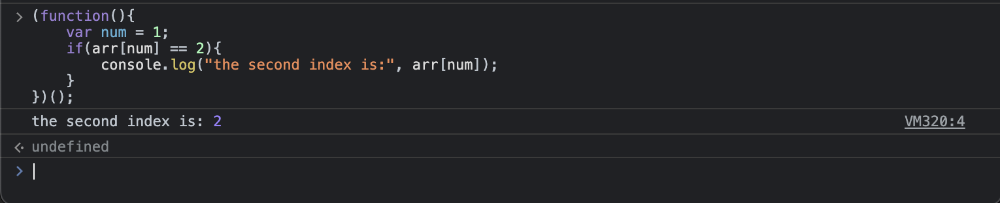

# StackAdapt Test

## Task 1

## Description
- The purpose of this application is to display a 12 Days of Christmas sale advertisement. The sale changes based on the users date.
- The application uses the Google Sheets API, and retrieves data from a [csv file](https://docs.google.com/spreadsheets/d/1D4-ZYeQS7-hS_uOeJ62vRHsJODcnn1pEYBqJgsGfu_Q/edit#gid=1383889228) that contains all information on the upcoming sale.

## How to run?
- A Google API key is required for this application to run. Here is [video](https://www.youtube.com/watch?v=nqlyLZxX0ys&ab_channel=DealsandTrainingbySan) on how you can create an API key, and enable the Google Sheets API.
- Once the key is ready open the project folder
- Open the file config.js
- Set the variable **GOOGLE_API_KEY** equal to your Google API Key
- Open the file **index.html** in a browser and the application will run

## How to test specific dates?
- Currently, the application is set to use the users current date. Follow the steps below to test alternative dates.
- Open the file **script.js**
- Scroll down to line 36
- Comment out the line
- Uncomment line 37
- Now you are able to modify the parameters inside of the Date object.
- Below is how the code should look if you want to test the date January 2, 2023



## Known Issues
- The given [csv file](https://docs.google.com/spreadsheets/d1D4-ZYeQS7-hS_uOeJ62vRHsJODcnn1pEYBqJgsGfu_Q/edit#gid=1383889228) has a incorrect URL on row 9.



## Improving Performance
- One way to improve the performance of this application is to store all fetched data into the browsers local storage. This way users won't have to wait as long for ads to load.
- The downside of this approach is that any updates to the csv file won't show on the users end unless they clear their local storage.
- This problem can be avoided by adding a timestamp to local storage, and updating the data once a certian amount of time has passed by.
- Even though this solution is better it still doesn't offer instant updates, so I deciced not to implement it.

## Desktop View 300x600px



## Mobile View 320x50px



## Start of Task 2



### Discussion about the ouput

- Cureently, this code has no output. The anonymous doesn't exceute because there are no parentheses at the end of the function. Lets says the code looks like screenshot below:



- Now that we have parentheses at the end of the anonymous function the output is **the second index is: 2**

### Feedback
Hello! Thank for submitting your code for review! I tried to run the code you have provided, however, it seems like there is a minor bug, which is preventing the code from running. The anonymous function you have created won't run because it missing a pair of parentheses at the end of the function. To fix this problem simply add a pair parentheses at the end of your function. Here is what it will look it:

```
(function(){
    var num = 1;
    if(arr[num] == 2){
        console.log("the second index is:", arr[num]);
    }
})();
```

Even though the code above will work, I would like to share an alternative solution that is a little shorter. Since the objection of your code is to print the 2nd index of the array named arr we can remove all the code execpt for the console.log

```
console.log("the second index is:", arr[2]);
```

The code above is straight to the point, and fantastic for a quick test. However, if you find yourself checking the value of an array index fairly often I would reccomend creating a reusable function:

```
function arrIndexValue(index){
    console.log(`The value of index ${index} is: ${arr[index]}`);
}
```

In the code above I have created a function called arrIndexValue that takes an array index number as a parameter. This will allow you to check the value of any index in the array arr! This approach will allow you to have less repetitive code in the future if you find yourself checking the the values in arr often.


